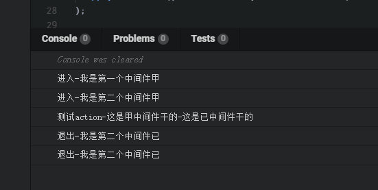
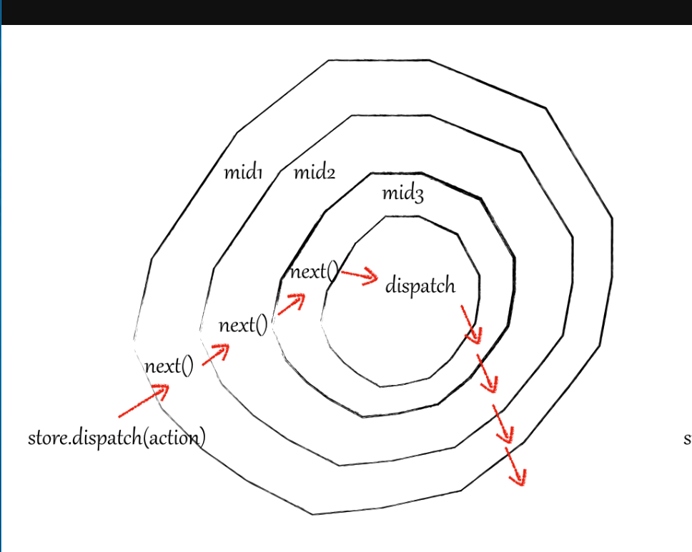

# 前言

**在工作中其实会经常使用到 redux 数据状态处理库，在一开始的使用中就一直听到说 reducer 必须是一个纯函数，不能有副作用!state 需要有一个默认值!等等的约束。当然也踩过含有副作用修改了 state 造成视图层不更新的 bug(state 嵌套过深的锅。。。) 一直停留在知其然不知其所以然的层次 想到彻底的掌握以及明白 redux 的原理的办法当然就是直接阅读源码啦 而且 redux 非常简洁才 2kb 而已= = 非常值得一读**

> redux 本质就是一个具有增强功能(中间件)的发布订阅函数 而 applyMiddleware 实质上就承担了增强 redux 的作用。

# applyMiddleware 的基本使用

```javascript
//常用的三个api
import { createStore, combineReducers, applyMiddleware } from "redux";
//中间件
import thunk from "redux-thunk";
import logger from "redux-logger";

//applyMiddleware使用中间件增强dispatch
const enhancer = applyMiddleware(thunk, logger);
//createStore 创建一个 Redux store 来以存放应用中所有的 state，应用中应有且仅有一个 store(react-redux有兼容多个store的写法，后面解读react-redux再说啦)
const store = createStore(reducers, null, enhancer);
export default store;
```

> 在讲解 applyMiddleware 函数之前有必要先理解 compose 的作用

上源码，为了减小篇幅，我删减了很多没用的代码（包括一些错误边界处理，其实很多错误边界处理都很有意思），如果想看完整的 redux 代码注释的话可以点击[**这里**](https://github.com/carrot-wu/Learn-Redux-Ecosystem "Markdown")。

# compose

```javascript
export default function compose(...funcs) {
  //如果没有传入中间件 直接把原始的store.dispatch函数返回出去
  if (funcs.length === 0) {
    return arg => arg;
  }
  //传入一个中间件 直接返回这个中间件函数
  if (funcs.length === 1) {
    return funcs[0];
  }
  //传入两个或两个以上的中间件时
  //返回一个把传入的中间件数组从右到左依次执行的函数
  return funcs.reduce((a, b) => (...args) => a(b(...args)));
}
```

compose 一开始会对传入的中间件数量进行判断 在两个或以上的中间件传入时会调用这么一个函数 funcs.reduce((a, b) => (...args) => a(b(...args))) 这就是 redux 中洋葱模型的具体实现啦 为了方便理解我们展开一下

```javascript
//b为循环中的当前中间件 a为循环中上一个中间件
funcs.reduce(function(a, b) {
  return function(...args) {
    //依次从右到左调用中间件 把右边的中间件的执行返回值作为参数传入下一个中间件中
    const rightFunResult = b(...args);
    return a(rightFunResult);
  };
});
```

这条展开的表达式其实就是一个高阶函数 返回值还是一个函数 这个函数接受的参数就是我们传入的中间件 从右到左依次调用中间件函数 并且把调用上一个中间件执行后的返回值当做参数传给下一个中间件 记住这个函数的作用之后我们接下来就可以看 applyMiddleware 函数了

## applyMiddleware

我们都知道要给 redux 添加中间件就必须传入 enhancer 这个参数 在复习一下用法把

```javascript
const enhancer = applyMiddleware(thunk, logger);
const store = createStore(reducers, null, enhancer);
```

在传入了中间件的过程中 createStore 内部会进行判断 如果传入了 applyMiddleware 函数 redux 会调用 return enhancer(createStore)(reducer, preloadedState)这个函数 也就是 applyMiddleware(...中间件)(createStore)(reducer, preloadedState)

```javascript
//createStore源码
export default function createStore(reducer, preloadedState, enhancer) {
  //首先createStore接受三个参数第一个是必须的reducer函数，第二个为state默认值（可传） 第三个enhancer为增强的中间件
  if (typeof preloadedState === 'function' && typeof enhancer === 'undefined') {
    //redux允许第二个参数直接传入中间件  判断第二个参数是否为函数 并且第三个参数为undefined（证明用户省略了state默认值，传入了第二个参数是中间件）
    enhancer = preloadedState
    preloadedState = undefined
  }

  if (typeof enhancer !== 'undefined') {
    //enhancer 必须是一个函数
    if (typeof enhancer !== 'function') {
      throw new Error('Expected the enhancer to be a function.')
    }
    //如果传入了中间件的话 那么就直接执行这个中间件函数
    return enhancer(createStore)(reducer, preloadedState)
  }
  ...略
```

接下来直接看 applyMiddleware 的源码 其实源码行数不多

```javascript
export default function applyMiddleware(...middlewares) {
  return createStore => (...args) => {
    //根据传入的reducer, preloadedState生成一个原始的store
    const store = createStore(...args);
    const middlewareAPI = {
      getState: store.getState,
      //这里的dispatch是原始的store dispatch 至于包多一层函数 是因为dispatch会传入每一个中间件中 要是不用函数包着的话 要是有一个中间件人为的修改了dispatch方法的引用 那么全部的中间件传入的dispatch也被修改了
      dispatch: (...args) => dispatch(...args)
    };
    //执行每个中间件 生成闭包 传入middlewareAPI参数  这样子每个中间件都可以使用getState 和 dispatch方法
    const chain = middlewares.map(middleware => middleware(middlewareAPI));
    //compose方法 从右到左依次执行中间件的函数
    /*
    *  const chainFn = compose(...chain) 返回一个从右到左依次执行中间件的函数
    *   dispatch = chainFn(store.dispatch) 执行这个返回的函数 传入store.dispatch函数
    * */
    dispatch = compose(...chain)(store.dispatch);

    //这样子的dispatch就是增强过后的dispatch方法
    return {
      ...store,
      dispatch
    };
  };
}
```

applyMiddleware 一开始会通过原始的 createStore 方法生成一个没有改造过的 store 对象 然后对外暴露的 dispatch 方法其实是经过中间件改造的 dispatch。

为了更好的理解 **const chain = middlewares.map(middleware => middleware(middlewareAPI))** 这里以及之后的代码 我先贴上 redux-thunk 中间件的源码(展开过后的)

```javascript
function reduxThunk(extraArgument) {
  //applyMiddleware(reduxThunk()) 我们传入的中间件的其实是执行函数后下面返回的函数 在这里我把返回的函数直接当做中间件
  return function({ dispatch, getState }) {
    //{ dispatch, getState }为传入的middlewareAPI 再次返回一个函数
    return function(next) {
      //next参数为compose方法中 上一次传入的中间件经过改造后的 (next) => action =>{} 函数
      return function(action) {
        //最终返回的函数就是经过中间件改造的dispatch
        if (typeof action === "function") {
          return action(dispatch, getState, extraArgument);
        }
        return next(action);
      };
    };
  };
}
```

- reduxThunk 中间件接受一个对象，还记得上面的 **constchain = middlewares.map(middleware => middleware(middlewareAPI))** 吗，这里的{ dispatch, getState }就是传入执行的 middlewareAPI。
- applyMiddleware 内部执行了一次传入的中间件并且传入了这个 middlewareAPI 对象，又返回了一个高阶函数 **const hoc = (next) => action =>{}** 。
- **dispatch = compose(...chain)(store.dispatch)** 中的 store.disptch 就是最开始传入的 next 回调函数，执行完之后又返回一个函数 **(action) =>{ next(action) }** 。其中的 **next** 就是 store.dispatch。
- 这个 **(action) =>{ next(action) }** 会当做回调函数再次传给左边的中间件的 next 参数，这个回调函数就变成左边中间件的 next。 就这样依次嵌套形成了洋葱模型。
- 最终 export 出去 dispatch 就是经过中间件增强过后的 dispatch。在调用 dispatch 的过程中，传入的 action 会经过第一个中间件的 **(action) =>{ next(action) }** 方法，执行到 **next(action)** 的时候就会调用第二个中间件的回调函数，以此类推。reduxThunk 之所以能处理函数就是英文在 **next(action)** 前先判断了 action 的类型。如果是函数的话先调用传入的 action 函数并且把 **{dispatch, getState}** api 传入到了函数中。

# 洋葱模型

为了更好地理解 redux 中的洋葱模型，我决定先自定义两个很简单的中间件

```javascript
function firstMiddleware({ dispatch, getState }) {
  return function(next) {
    return function(action) {
      console.log("进入-我是第一个中间件甲");
      //给action加上一点操作
      action.text += "-这是甲中间件干的";
      next(action);
      console.log("退出-我是第二个中间件已");
    };
  };
}

function secondMiddleware({ dispatch, getState }) {
  return function(next) {
    return function(action) {
      console.log("进入-我是第二个中间件甲");
      action.text += "-这是已中间件干的";
      next(action);
      console.log("退出-我是第二个中间件已");
    };
  };
}
//编写reducer
function reducer(state = null, action) {
  switch (action.type) {
    case "testAction":
      console.log(action.text)
      return action.text;
    default:
      return state;
  }
}
const store = createStore(
  reducer,
  applyMiddleware(firstMiddleware,secondMiddleware)
);

store.dispatch({ type: 'testAction',text:'测试action' });

```
结果

>如果图片挂了的话 直接看文字吧
- 进入-我是第一个中间件甲
- 进入-我是第二个中间件甲
- 测试action-这是甲中间件干的-这是已中间件干的
- 退出-我是第二个中间件已
- 退出-我是第二个中间件已

**可以看出，dispatch（action）的过程中回先执行第一个中间件的(action)=>{}方法，在遇到next(action)的时候，会执行下一个中间件的回调方法，依次调用直到穿过了所有的中间件。最后会把action返回给初始的store.dispatch(action)进行调用reducer函数，在这过程中只要保证最后传给store.dispatch的action是一个对象，在任意的中间件中你可以任意的调戏action。**

**执行完reducer更新state之后因为最后一个中间件执行完next（action）回调函数之后，从右到左依次执行完next(action)下面的代码**

**最终形成了 甲（进入）- 已（进入）.... - store.dispatch(action) - .... - 已(退出) - 甲(退出) 的流程**

借一张网上的洋葱模型图就会更加清楚啦



# 最后
终于分析完啦，大家应该对于redux会有更充分的了解。尤其是中间件这块，redux-thunk之所以能处理函数类型的action。(ps：顺便提一个问题，在看redux-logger中间件源码的过程中作者提到了redux-logger必须放在中间件数组的最后一个。为什么呢？如果你认真的看完了这篇文章应该大致就会懂了。)最后贴上项目的[**github链接**](https://github.com/carrot-wu/Learn-Redux-Ecosystem "Markdown")，上面会有redux完整源码以及更加详细的注释，如果这系列文章对您真的有能帮助的话不妨点个star？哈哈哈，谢谢各位老哥啦。（同目录下react-redux的源码注释也有，不过我发现要拆分成写文章的形式真的挺耗费时间的。哈哈哈哈哈哈哈，有空再更新吧）